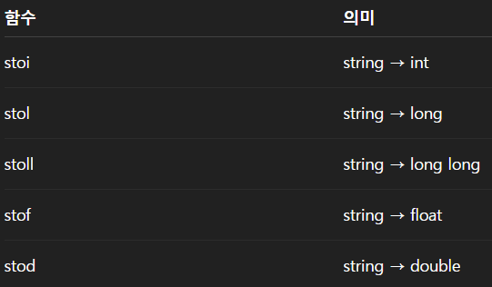

# programmersCPP
C++ 코딩문제풀이
[프로그래머스](https://school.programmers.co.kr/)

## 연습

### Level 0
1. [문자열 출력](./level0/01/01.cpp)
    - char는 기본 자료형이고 string은 여러 글자 저장(문자열) 클래스형태
    - '>>' 연산자는 공백,탭,줄바꿈을 구분자로 사용, 즉 스페이스바 클릭하면 앞까지만 입력 버퍼에 남는다.
    
2. [정수입력 받기](./level0/02/02.cpp)

3. [문자열 반복 출력](./level0/03/03.cpp)

4. [대소문자 변경](./level0/04/04.cpp)
    - 아스키 코드로 풀이.
    - 'a' , 'A'로 풀이가능
    - `함수 사용`
        - islower() - 소문자인지 확인
        - toupper() - 대문자로 변환
        - tolower() - 소문자로 변환
5. [특수문자 출력](./level0/05/05.cpp)
    - 이스케이프 문자 앞에 \붙여야함.
    - C++11 이상부터 R"~~~"; 로 모든 문자 출력가능
6. [4+5=9](./level0/06/06.cpp)
7. [문자열 붙여서 출력하기](./level0/07/07.cpp)
    - `문자열(string)+문자열 가능!!`
8. [문자열 돌리기](./level0/08/08.cpp)
9. [홀짝 구분하기](./level0/09/09.cpp)
`10`. [문자열 겹쳐쓰기](./level0/10/10.cpp)
    - include \<vector\>
        - **기본 함수**
        - 동적으로 늘어났다가 줄어드는 배열을 사용하기 위한 헤더.
        - push_back() - 뒤에 데이터 추가
        - pop back() - 맨 뒤 데이터 삭제
        - size() - 길이
        - empty() - 비었는지 확인
        - clear() - 모든 데이터 삭제
        - insert(위치,넣을 값) - 중간에 데이터 삽입
        - erase(삭제 인덱스) - 중간에 데이터 삭제
        - erase(시작 인덱스,마지막 인덱스) - 중간 범위 데이터 삭제
        - begin() - 시작 `주소`
        - end() - 마지막 `주소`
        - front() - 시작 `값`
        - back() - 마지막 `값`

        - **최적화 함수**
        - reserve() - push_back은 메모리 공간이 없을 시 >> 새 메모리 생성 + 기존 메모리 복사 => 느림
            - reserve(1000)은 미리 공간을 확보, 빠름
        - emplace_back() - push_back은 새 객체 생성 + 복사를 하지만 emplace_back은 vector안에 바로 복사.
        - remove(v.begin(), v.end(), value) - 범위 내에서 value과 같은 숫자를 제외하고 앞으로 복사.
            - ex) value=2, 123242 >> 134242 앞으로 복사만 할뿐 뒷메모리를 삭제하질 않음
            - v.erase(remove(v.begin(), v.end(), value), v.end()); 
            - remove()함수는 유효데이터 새로운 끝 위치를 반환함. 
11. [문자열 섞기](./level0/11/11.cpp)
    - 문자열에서 push_back이랑 + 차이점
        - push_back - char형만 붙일 수 있음
            - vector\<string\>의 push_back은 string 추가 가능
        - +,+= - char,string 모두 가능
12. [문자 리스트를 문자열로 변환하기](./level0/12/12.cpp)
    - vector\<string\> arr 이란 문자열을 여러 개 저장하는 동적 배열.
13. [문자열 곱하기](./level0/13/13.cpp)
14. [더 크게 합치기](./level0/14/14.cpp)
    - 
15. [두 수의 연산값 비교하기](./level0/15/15.cpp)
16. [n의 배수](./level0/16/16.cpp)
17. [공배수](./level0/17/17.cpp)
18. [조건 문자열](./level0/18/18.cpp)
19. [flag에 따라 다른 값 반환하기](./level0/19/19.cpp)
    - true는 0이 아닌 모든 값.
    - 변수flag가 있을때 조건식
        - (flag==true),(!flag),(flag) 등등 가능.
20. [코드 처리하기](./level0/20/20.cpp)
    - mode=0(false)일 때 !mode=1을 뜻한다. 0,1 토글할 때 아주 편리
21. 
    
    
